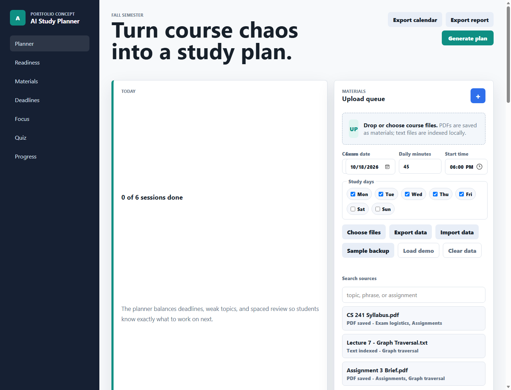
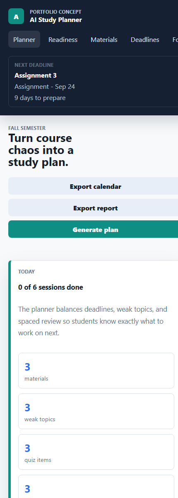

# AI Study Planner

AI Study Planner is a portfolio app concept for turning course materials into a focused study system. Students can upload syllabi, notes, PDFs, assignments, and exam dates, then get a study schedule, quizzes, weak-topic tracking, and answers grounded in their own materials.

## Live Demo

Try the deployed prototype:

https://timothychristian23.github.io/ai-study-planner/

## Screenshots





## Demo Walkthrough

1. Click `Load demo` to restore the seeded course, materials, deadlines, progress, and answer history.
2. Click `Generate plan` to build an adaptive study schedule from deadlines and weak topics.
3. Use the `Quiz` panel to reveal an answer, then mark it as `Needs review` or `Got it`.
4. Ask a question in `Ask materials` to see a grounded answer with cited source excerpts.
5. Export the plan with `Export calendar`, `Export report`, or `Sample backup`.

## What I Built

This is a dependency-free static prototype focused on the core product workflow: local material intake, planning, practice, weak-topic tracking, retrieval-style answers, and portfolio-ready exports. It runs in the browser with `localStorage` persistence, a seeded demo state, and a Supabase-auth-ready account panel that stays disabled until configured.

Full-stack work is now underway with durable file storage, server-side parsing, embeddings, and AI-generated answers over retrieved material chunks. The static demo still keeps local-first study tools so the portfolio walkthrough works without credentials or paid API credits.

The first production foundation is scaffolded under `supabase/`, including Postgres tables, row-level security policies, a private storage bucket, signed-in file uploads, durable server-side material indexing jobs, vector search RPC, an auth-ready browser shell, cloud course selection, cloud autosave with manual safety controls, authenticated Edge Functions that can call OpenAI server-side, and browser fallbacks when cloud AI is unavailable.

## Current Prototype

This repo currently includes:

- Upload queue for syllabi, notes, PDFs, and assignments
- Drag-and-drop or file picker material intake
- Local persistence for course name, exam date, daily study minutes, and uploaded material metadata
- Lightweight local indexing for `.txt`, `.md`, `.csv`, and PDF files
- Source search across uploaded material names, topics, and indexed passages
- Assignment, quiz, project, and exam deadline tracking
- Deadline suggestions extracted from uploaded syllabus or assignment text
- Study availability controls for preferred days and calendar start time
- Study schedule preview organized around exam dates
- Study session completion tracking with total minutes studied
- Focus session timer with quick notes and progress updates
- Progress insights for confidence, streak, completed sessions, and recent activity
- 7-day activity trend for study minutes and quiz attempts
- Course and exam progress trend cards tied to pace, weak topics, readiness, and plan completion
- Exam readiness score with risk signals and next-step recommendations
- Spaced-review queue that schedules due and upcoming reviews into generated plans
- Adaptive schedule priority that weighs low confidence, quiz misses, due reviews, and deadline pressure
- Downloadable `.ics` calendar export for generated study sessions
- Downloadable Markdown study report with plan, deadlines, weak topics, reviews, and activity
- JSON backup/import controls plus a downloadable seeded sample backup
- Source-backed quiz cards generated from indexed course materials
- Quiz attempt history with accuracy, streak, and recent results
- Weak-topic tracker with priority levels
- Quiz feedback that changes topic confidence and reprioritizes the plan
- Material-grounded answer panel with passage retrieval and citations
- Grounded answer history with recent questions and cited sources
- Supabase-auth-ready account panel with sign in, sign up, and sign out controls
- Cloud course picker for loading, syncing, and creating multiple planner records
- Supabase autosave for course setup, materials metadata, deadlines, schedules, progress, quiz attempts, and grounded question history, plus manual sync/load safety controls
- Cloud conflict resolution actions for loading cloud, keeping local, or overwriting a changed planner
- Signed-in Supabase Storage uploads for raw course files, with storage paths saved on material records
- Signed download and reprocess controls for cloud-stored course files
- Server-side material indexing for stored PDFs and text-like files, with durable jobs, retry metadata, chunking, optional OpenAI embeddings, and local study mode when credits are unavailable
- Signed-in `Ask materials` answers from the authenticated retrieval Edge Function, with source-backed local retrieval fallback
- Signed-in quiz generation from indexed cloud material chunks, with source-backed local quiz fallback
- Responsive dashboard layout with mobile-friendly navigation and controls

For the most reliable PDF indexing, run a local static server and open the served URL:

```powershell
node scripts/dev-server.mjs
```

You can also open `index.html` directly in a browser for the non-PDF parts of the prototype.

## Deployment Smoke Tests

For the full deployment checklist, repository secrets, GitHub variables, and smoke-test interpretation guide, see `docs/deployment-smoke-setup.md`.

After applying Supabase migrations and deploying Edge Functions, run the non-destructive smoke checks:

```powershell
$env:SUPABASE_URL="https://your-project-ref.supabase.co"
$env:SUPABASE_ANON_KEY="your-supabase-anon-or-publishable-key"
$env:AI_STUDY_APP_URL="https://timothychristian23.github.io/ai-study-planner"
node scripts/supabase-smoke.mjs
```

For authenticated RLS CRUD coverage, create a dedicated Supabase test user and add:

```powershell
$env:SUPABASE_SMOKE_EMAIL="you+ai-study-smoke@your-domain.com"
$env:SUPABASE_SMOKE_PASSWORD="generated-dedicated-smoke-password"
node scripts/supabase-smoke.mjs
```

To run the optional AI fixture pass against deployed `ask-materials` and `generate-quiz`, also set:

```powershell
$env:SUPABASE_SMOKE_RUN_AI="1"
$env:OPENAI_API_KEY="sk-proj-your-openai-key"
node scripts/supabase-smoke.mjs
```

The smoke runner validates deployed table columns with `limit=0`, checks the static app assets when `AI_STUDY_APP_URL` is set, reaches deployed Edge Functions through validation paths that do not call OpenAI, and optionally signs in as the smoke user to create, read, update, and clean up an isolated temporary course with child rows. The authenticated pass also uploads, downloads, signs, verifies, and deletes a tiny file in the private `course-materials` bucket. The opt-in AI fixture seeds temporary vector chunks, calls deployed material Q&A and quiz generation, then cleans up through the same course cascade. GitHub Actions can run the same check from `Supabase Smoke Tests` when the `SUPABASE_URL` and `SUPABASE_ANON_KEY` repository secrets are set; add `SUPABASE_SMOKE_EMAIL` and `SUPABASE_SMOKE_PASSWORD` secrets to enable the authenticated CRUD and Storage pass, and set `SUPABASE_SMOKE_RUN_AI` plus `OPENAI_API_KEY` to enable the AI fixture. After deployment, `node scripts/index-job-monitor.mjs` can be run with `SUPABASE_SERVICE_ROLE_KEY` to check failed, stalled, and overdue indexing jobs.

## Product Goals

- Help students convert messy course materials into a practical plan
- Keep study sessions tied to upcoming assignments and exams
- Generate recall-based quizzes from the uploaded materials
- Track weak topics and recycle them into future study sessions
- Answer student questions using only trusted class materials

## Suggested Tech Direction

- Frontend: React, Next.js, or Vite once the prototype graduates from static HTML
- Backend: Node.js API routes or FastAPI
- Storage: Supabase or PostgreSQL for users, courses, files, and progress
- AI: Retrieval augmented generation over parsed class materials
- File processing: PDF/text extraction, chunking, embeddings, and source citations

## Roadmap

See `docs/roadmap.md` for a phased build plan, `docs/data-model.md` for the MVP data model, `docs/production-upgrade.md` for the production migration plan, `docs/deployment-smoke-setup.md` for deployment smoke-test setup, `docs/production-hardening.md` for launch hardening and rollback, `docs/production-validation.md` for final live validation notes, and `docs/portfolio-writeup.md` for the portfolio case study with screenshots.
