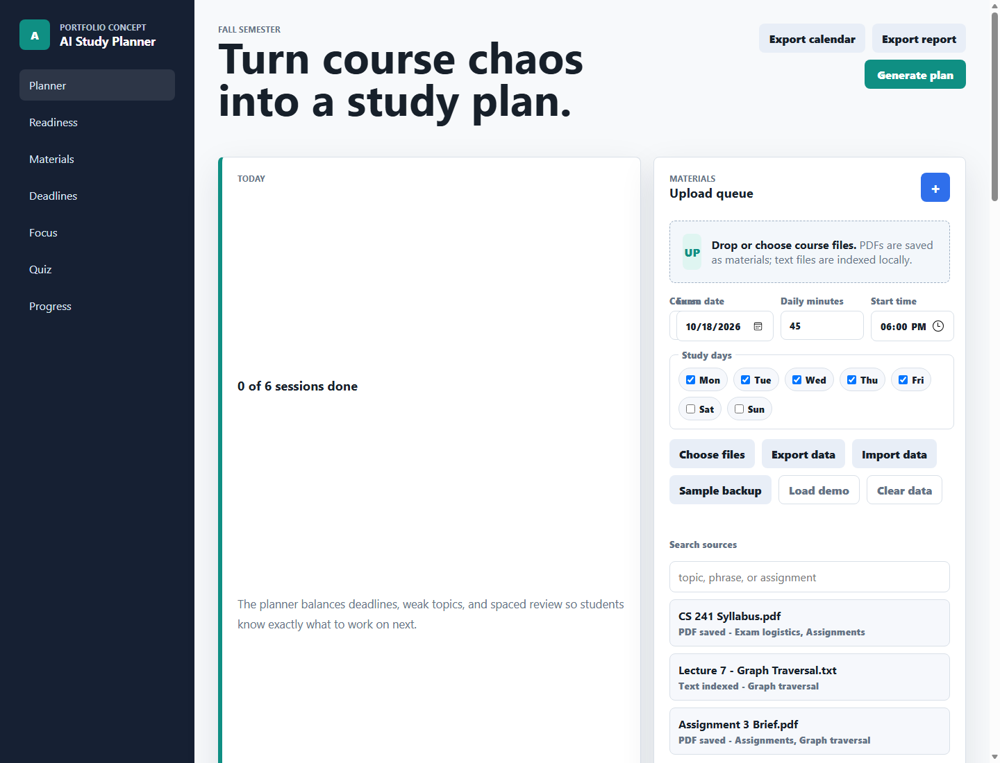
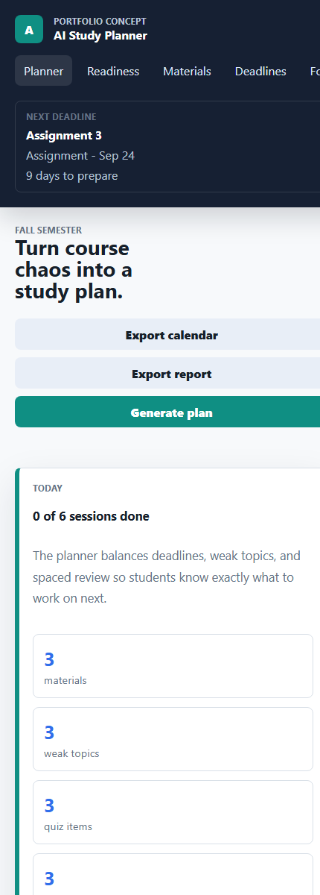

# AI Study Planner Portfolio Write-Up

AI Study Planner is a production-backed portfolio app that turns course materials, deadlines, and weak-topic feedback into a practical study workflow. The project demonstrates product thinking, local file handling, source-grounded retrieval, adaptive scheduling, cloud persistence, Supabase security, and Gemini-backed AI workflows.

## Outcome

- Public GitHub Pages demo with seeded local data for quick review
- Supabase-backed signed-in mode with Auth, RLS, private Storage, cloud course sync, and material indexing
- Gemini Flash-Lite Q&A and quiz generation over retrieved material chunks
- Live production smoke validation: 12 passed, 0 warnings, 0 failed for the Gemini upload/index/ask/quiz path
- Local fallbacks for source-backed study tools when cloud credentials or provider credits are unavailable

## Screenshots

## Problem

Students often know they need to study, but their course information is scattered across PDFs, syllabi, lecture notes, assignments, and exam announcements. The hard part is converting that pile into a specific plan: what to review, when to review it, and which weak topics need more practice.

## Solution

The app gives students one planning surface where they can upload course materials, set deadlines, generate a schedule, run focus sessions, quiz themselves, and ask questions grounded in indexed course text. Reviewers can explore the seeded browser demo immediately, while signed-in users can exercise the full cloud flow with private uploads and server-side AI.

## Key Features

- Local material intake for PDFs, text, Markdown, and CSV files
- Browser PDF/text indexing for source search, quiz generation, and grounded answers
- Deadline tracking plus local deadline suggestions from syllabus or assignment text
- Adaptive schedule generation based on weak topics, due dates, preferred study days, and start time
- Topic priority scoring that raises low-confidence, missed, review-due, and deadline-sensitive topics
- Focus timer with completion notes that feed back into topic confidence
- Source-backed quiz cards, quiz history, accuracy, and streak tracking
- Course and exam progress trends for weekly pace, weak topics, readiness, and plan completion
- Spaced-review queue with due reviews inserted into generated plans, plus exam readiness scoring
- Material-grounded answers with citations and recent question history
- Markdown report export, `.ics` calendar export, JSON backup/import, and seeded sample backup
- Responsive dashboard layout for desktop and mobile portfolio review
- Supabase Auth, RLS-protected cloud course data, private Storage uploads, and signed download/reprocess controls
- Server-side material indexing jobs with retry metadata, vector chunk storage, Gemini/OpenAI provider support, and source-backed local fallbacks

## Technical Notes

The frontend is intentionally dependency-free: static HTML, CSS, and JavaScript with `localStorage` persistence for the portfolio demo. PDF parsing uses PDF.js from a CDN when served from the local static server. The local retrieval path scores indexed passages with keyword/topic matching, keeping the demo understandable while mapping cleanly to the cloud RAG workflow.

The production foundation extends the static app with Supabase Auth, row-level security, private Storage uploads, Edge Functions, vector-ready material chunks, Gemini/OpenAI-backed Q&A and quiz generation, durable indexing jobs, deployment smoke tests, an operations monitor for failed or stalled indexing work, and local fallbacks when cloud AI is unavailable.

## Production Validation

The live Supabase project has been validated with migrations through `0005_ai_provider_embeddings.sql`, deployed Edge Functions, configured Gemini secrets, and a temporary-user smoke test. The latest Gemini smoke created a confirmed auth user, uploaded a private material, indexed it with Gemini embeddings, asked a grounded question, generated a quiz card with Gemini Flash-Lite, and cleaned up the temporary data. See `production-validation.md` for the validation record.

## Product Decisions

- Keep source citations visible so answers feel grounded rather than magical.
- Treat weak-topic confidence as a shared signal across quizzes, sessions, readiness, and schedule priority.
- Blend quiz misses, due reviews, and deadline pressure into schedule priority so the plan responds to student behavior.
- Include backup and sample-demo workflows so reviewers can reset or move a portfolio state quickly.
- Export reports and calendars because students need artifacts they can use outside the app.

## Future Build

The next product step is a manual browser walkthrough with a dedicated smoke account, then deeper adaptive learning across cloud quiz history, topic progress, and generated schedules. The production foundation already has the main backend pieces for authentication, durable course storage, file object storage, extracted material chunks, embeddings, and AI-generated answers over retrieved chunks.
